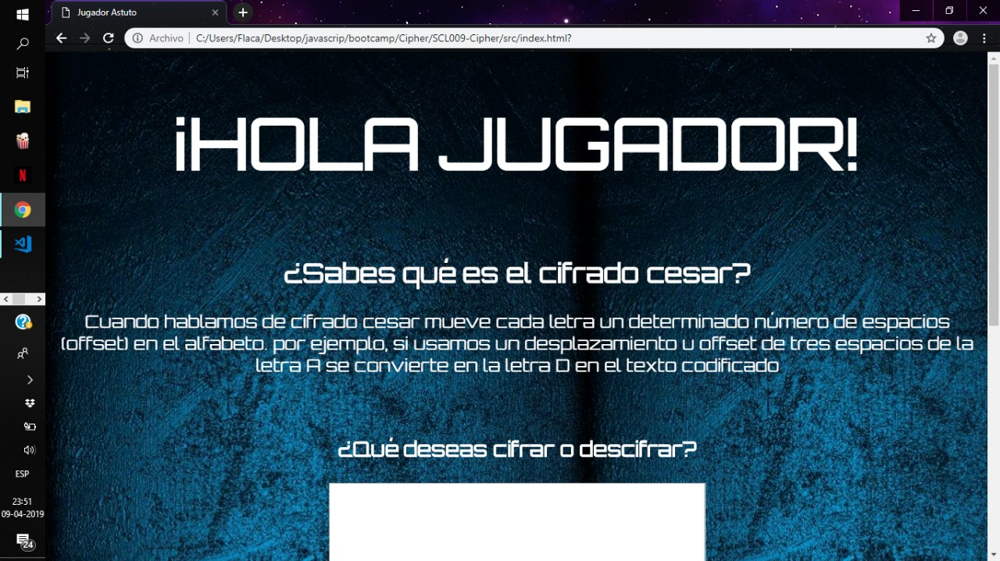
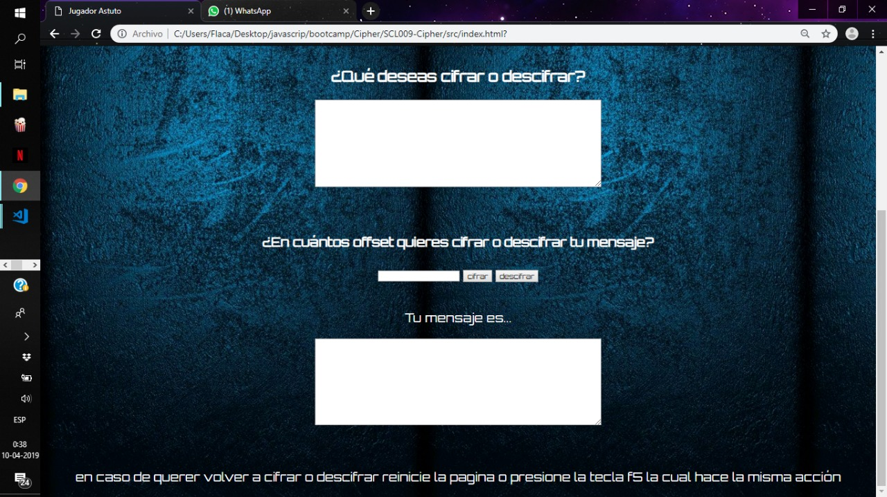
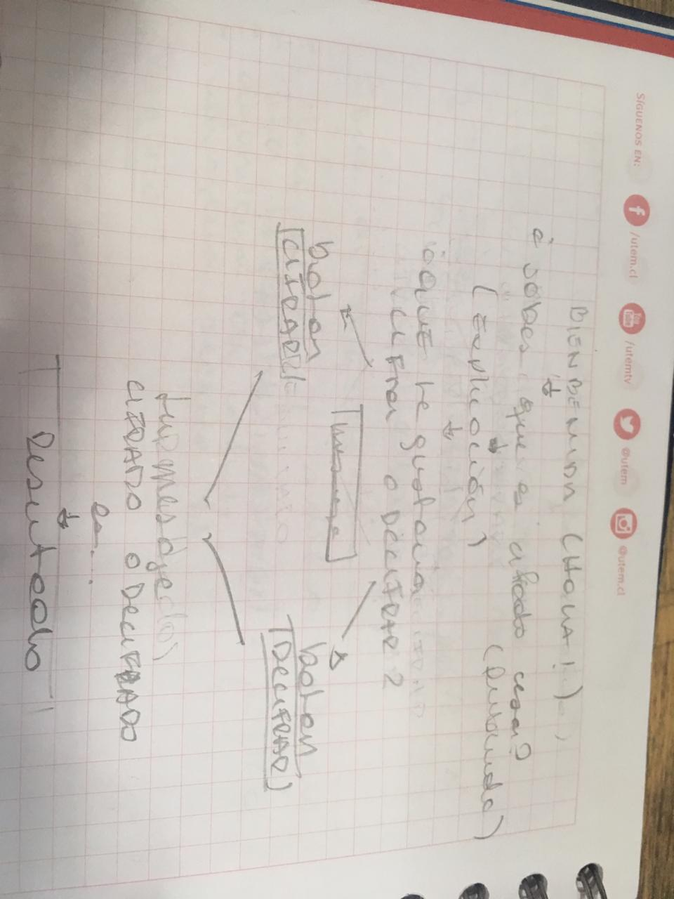
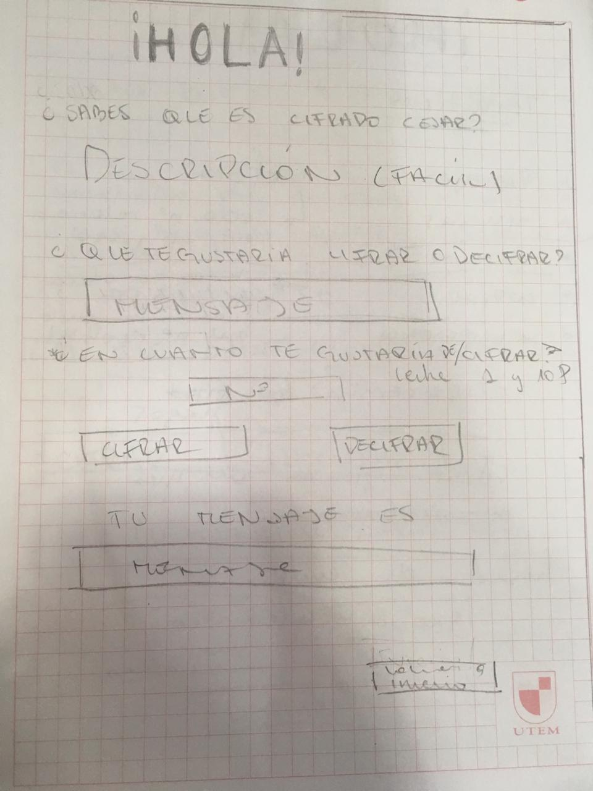
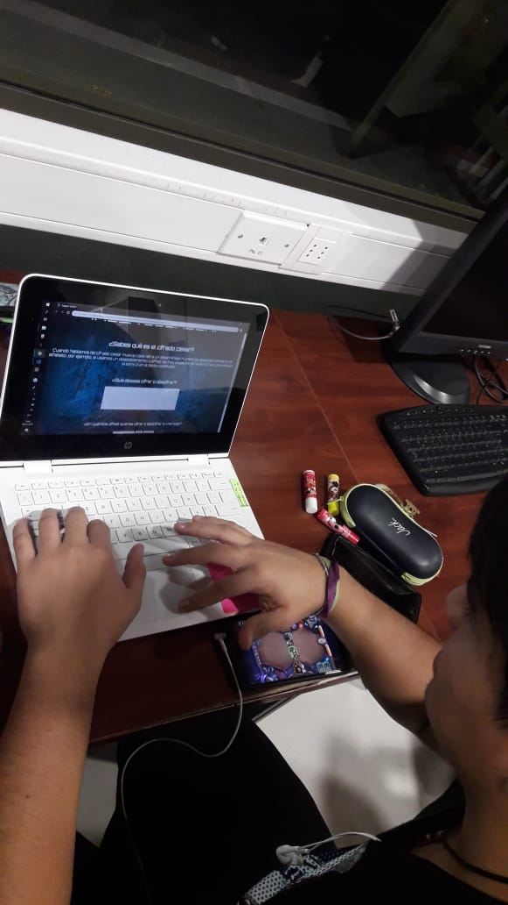
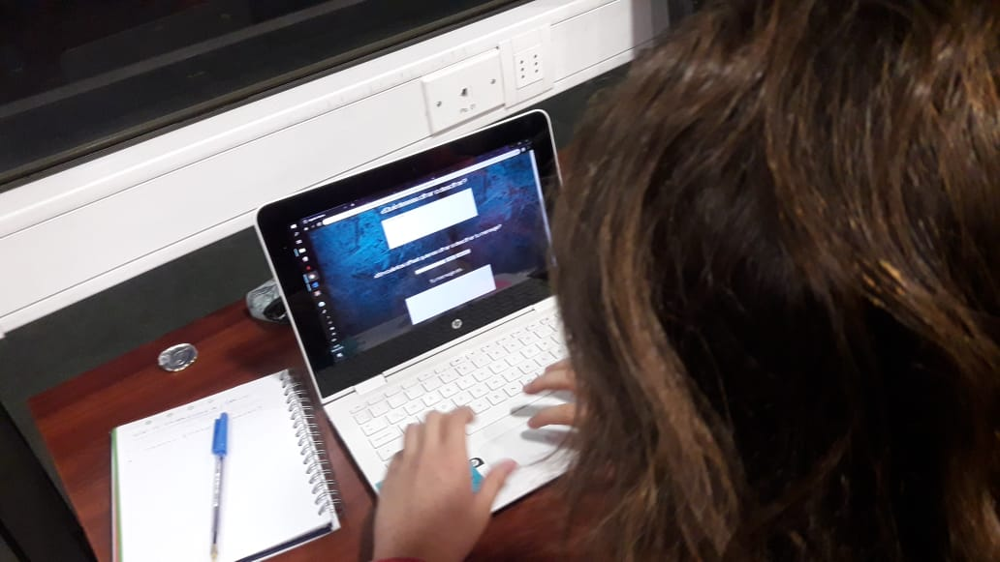
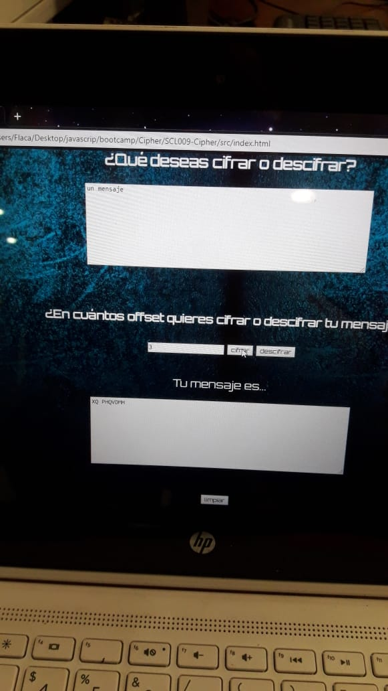
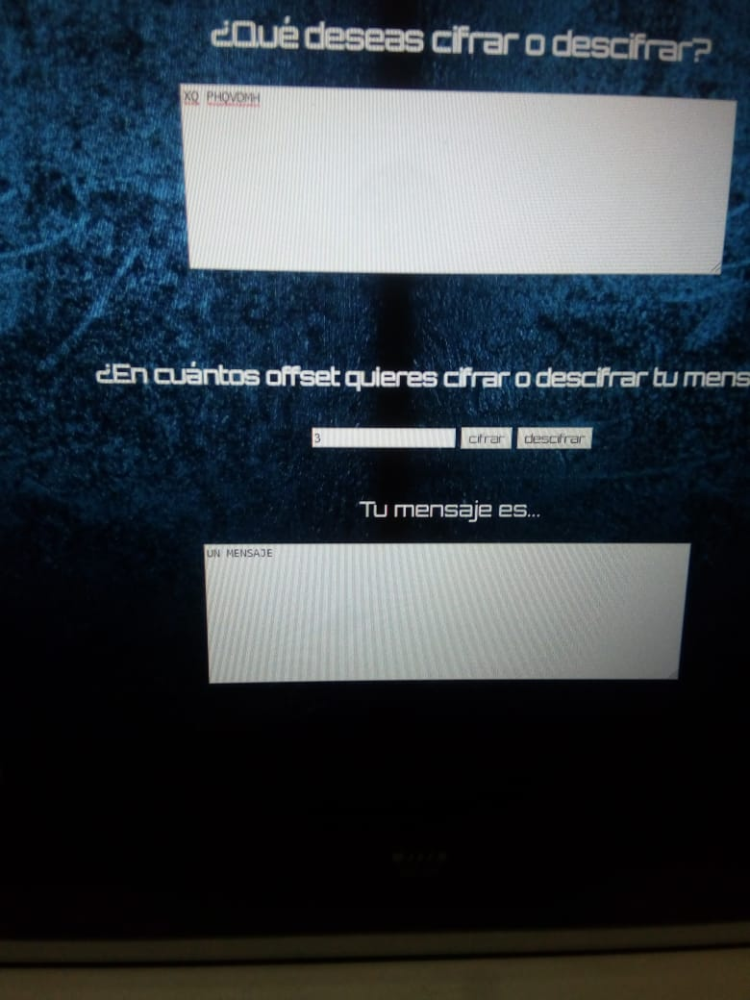

# jugador astuto

"Jugador astuto" es una aplicación para que los jugadores en línea puedan enviar sus estrategias a sus compañeros en el juego. La base de esta aplicación es el Cifrado César el cual se basa en mover un determinado espacio ( offset ) la letra original, creando un nuevo mensaje.

Aqui les dejo el enlace para que la vean [enlase](https://dhaarmaa.github.io/SCL009-Cipher/src/index.html)

Al principio fui a un grupo x de personas a preguntarle _si tuviéran la posibilidad de mandar un mensaje codificado, encriptado o cifrado, de que les gustaría que fuera. La respuesta en general de la mayoría fue copiar en pruebas, pero una persona x mencionó juegos_. Me llamó la atención y averigüe sobre estrategias(chat, juegos, etc). La temática se basó en los juegos en línea, con el objetivo de que los jugadores  se puedan enviar sus estrategias en el chat global y que los contrincantes no puedan saber qué se está diciendo. Lo ideal de meta para más adelante es lograr que desde mi página pueda enviarse directamente el mensaje cifrado o descifrado al chat de los juegos.

Para lograr hacer este proyecto tuve la necesidad de organizarme de algun modo, para esto utilice la aplicación trello. Aqui les dejo el [enlace](https://trello.com/b/e7O7olCM/cifrado-cesar) para que puedan verlo.

La estructura de la página es ordenada y simple para que se logre entender, la cual es:

- **Bienvenida** : La cual contiene el saludo al jugador.

- **Definición** : En esta sección se le pregunta al jugador si se conoce el cifrado cesar y la pequeña definición de lo que es, explicando que es el desplazamiento. 

- **mensaje** : El usuario en esta parte escribirá su mensaje .. el cual quiera cifrar o descifrar.

- **offset** : En esta parte el usuario decide la cantidad de offset o espacios que se mueven las letras del abecedario, creando el mensaje nuevo.

- **nuevo mensaje** : En esta sección se da a ver el resultado o nuevo mensaje ya cifrado o descifrado del usuario.

- **final** : en esta parte se le recomienda el usuario reiniciar la página si quiere volver a cifrar o descifrar lo que indica la tecla "f5"que tiene la misma acción.

En esta parte mostraré el control de flujo de usuario.

En esta parte mostraré el prototipado de baja fidelidad: 

 

## Prueba de usabilidad

Al tener el prototipado de alta fidelidad en la sonda con 3 usuarios, a los que se les da una pequeña explicación de que se trata la página, y se les pide que sigan losmpasos que esta pide.

En conclusión de estos tres usuarios:

Dan a un conocer que el prototipado es bastante claro, las acciones que pide la página son  faciles de entender, en el aspecto visual, es agradable a los ojos tanto los colores como el formato de la letra que se ocupa.