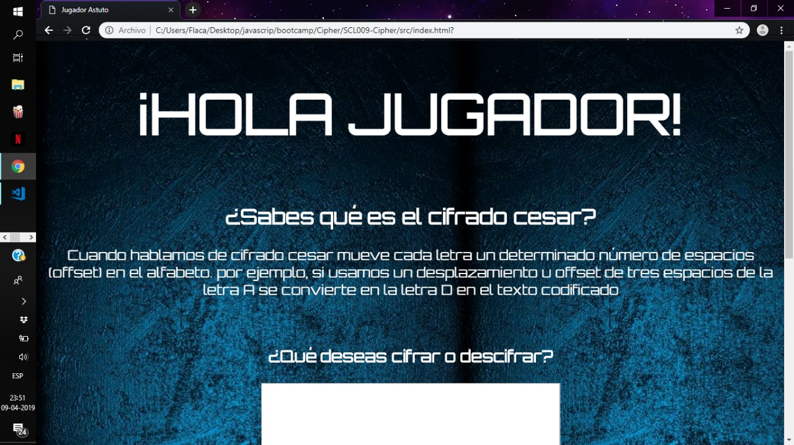
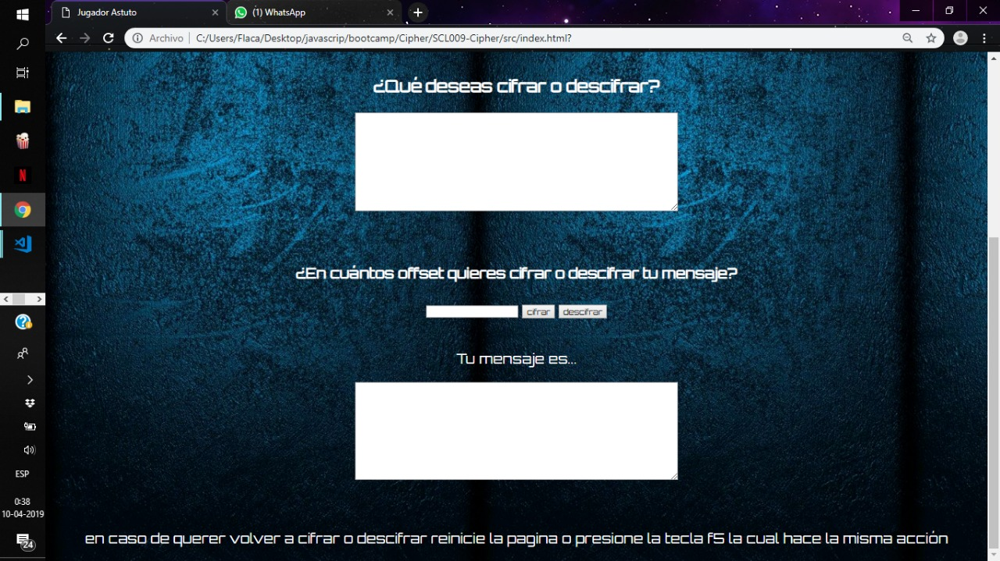
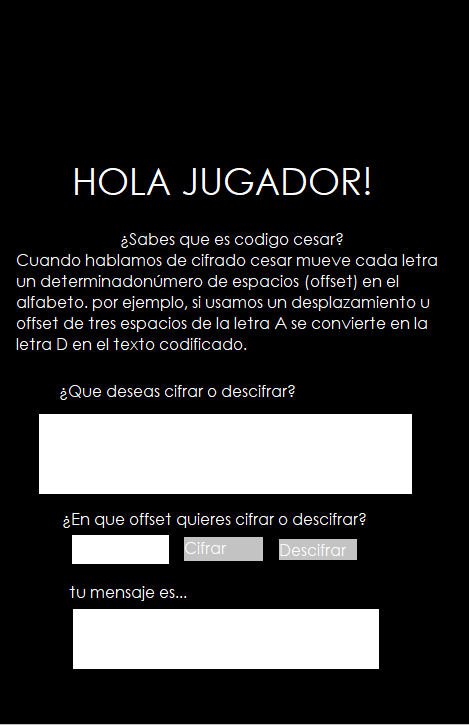
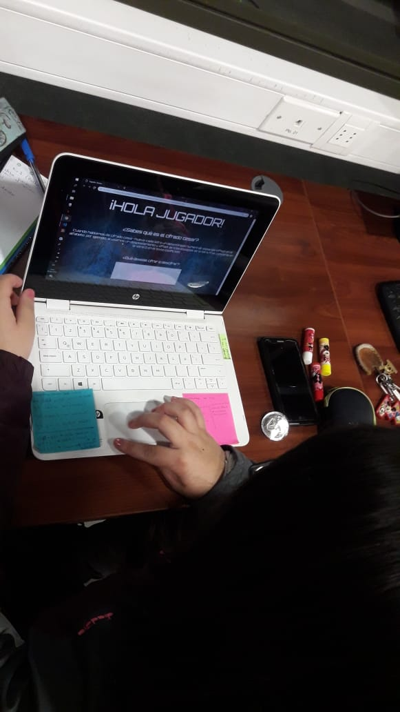
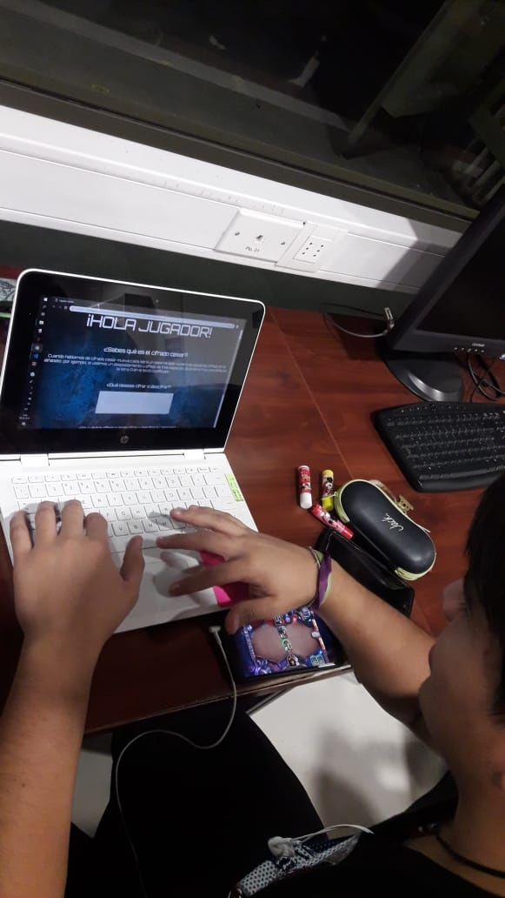
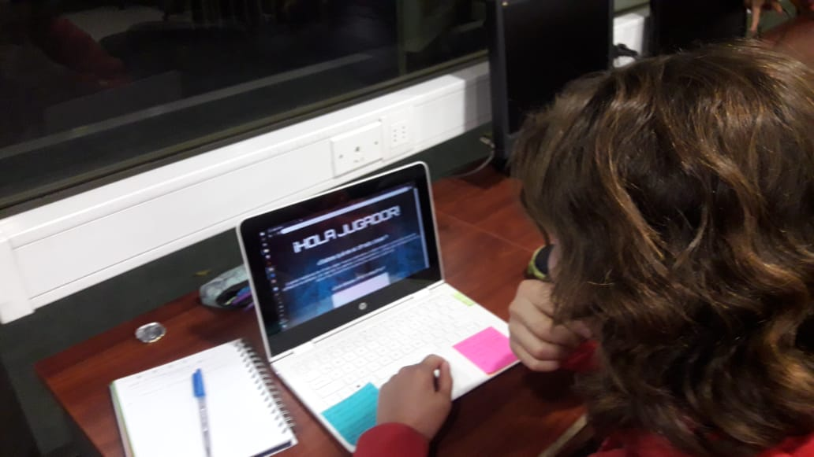
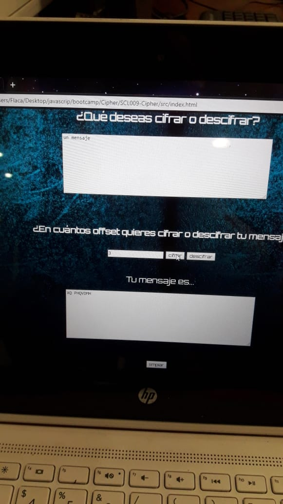
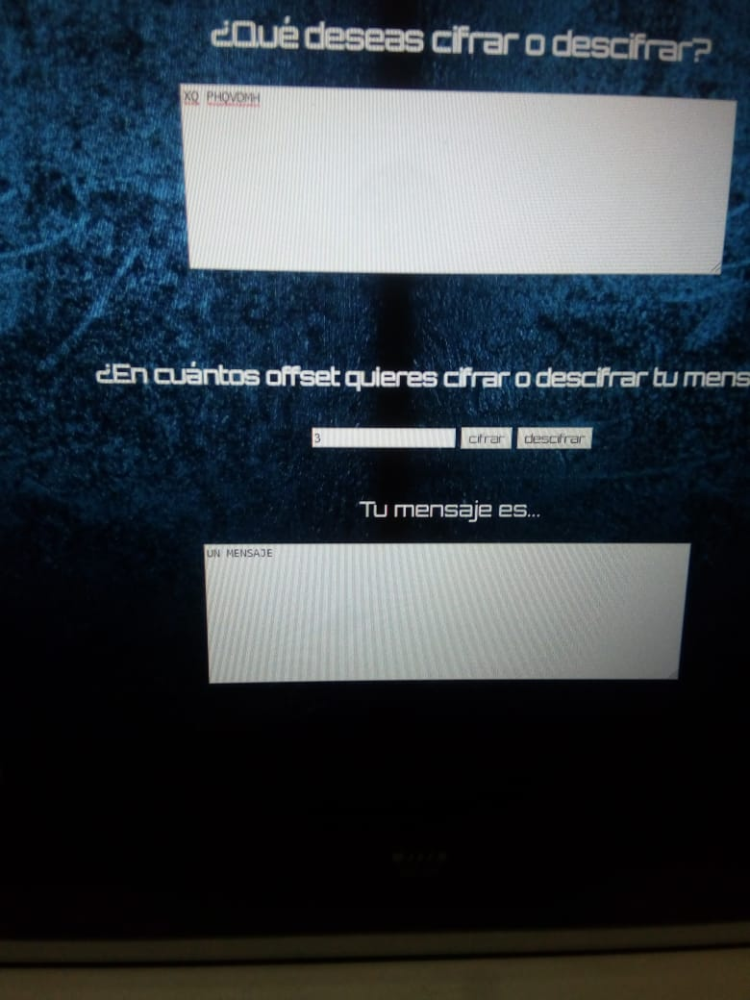

# **Jugador Astuto**  : video_game :

: space_invader : "Jugador astuto" es una aplicación para que los jugadores online puedan enviar sus estrategias a sus compañeros en el juego.
La base de esta aplicación es el Cifrado Cesar el cual se basa en mover un determinado espacio(_offset_) la letra original, creando un nuevo mensaje.

: no_mouth : Pueden verificar la página en este [enlace](https://dhaarmaa.github.io/SCL009-Cipher/src/index.html)

 

Al comienzo fui a un grupo x de personas a preguntarle _si tuvieran la posibilidad de mandar un mensaje codificado, encriptado o cifrado , de que les gustaría, hubieron diferentes respuestas en general la mayoría fue copiar en pruebas...y una persona x mencionó juegos_ me llamó la atención y averigüe sobre estrategias, chat, juegos. 
La temática  fue basada en los jugadores online, con el objetivo que puedan enviarse sus estrategias encriptadas en los chat globales sin que los contrincantes puedan saber  que se estan diciendo.
Lo ideal de meta para más adelante es lograr que desde mi página puedan enviar directamente el mensaje cifrado o descifrado al chat de los juegos.

Para hacer este proyecto necesitaba organizarme y planificar mi tiempo, para hacerlo ocupé la aplicación trello. Aqui está el enlace de mi planificación [enlace](https://trello.com/b/e7O7olCM/cifrado-cesar)

La estructura de la página es ordenada y simple para que se logre entender, la cual es:

- **Bienvenida**: La cual contiene el saludo al jugador

- **Definición**: En esta sección se le pregunta al jugador si conoce que es el _cifrado cesar_ y se da una pequeña definición de lo que es, explicando que es el _offset_ 
 

- **mensaje**: El usuario en esta parte escribirá su mensaje .. el cual quiera cifrar o descifrar.

- **offset**: en esta parte el usuario decide la cantidad de offset o espacios que quere mover las letras del abecedario, creando el mensaje nuevo.

- **nuevo mensaje**: en esta sección se dará a ver el resultado o nuevo mensaje ya cifrado o descifrado del usuario

- **final**: en esta parte se le recomienda al usuario reiniciar la página si quiere volver a cifrar o descifrar indicándole que también puede presionar la tecla f5 que hace la misma acción.

En esta parte mostraré el prototipado de baja fidelidad:

: Ojos : **Test de usabilidad** 

Al tener el prototipado de alta fidelidad
lo probé con 3 usuarios, a los cuales les di una pequeña explicación de que se trabaja la página y les indique le vieran la pagina y siguieran los pasos que se pide.

 

 

 

 

En conclusión de estos tres usuarios...

Dan a conocer que el  prototipado es bastante claro, las acciones que pide la página son fácil de entender, en aspecto visual, es agradable a los ojos tanto los colores como el formato de letra que se ocupó. : Sonrisa :
